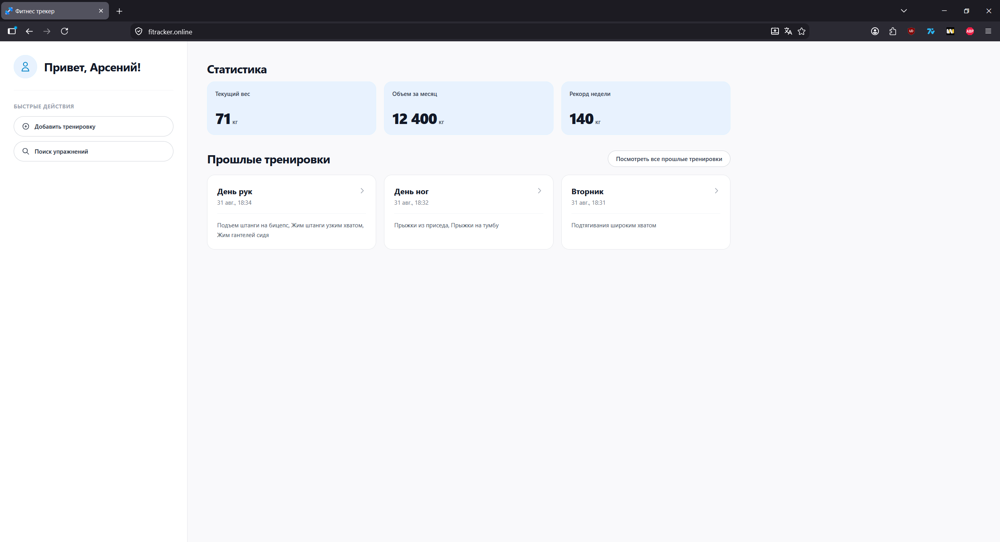
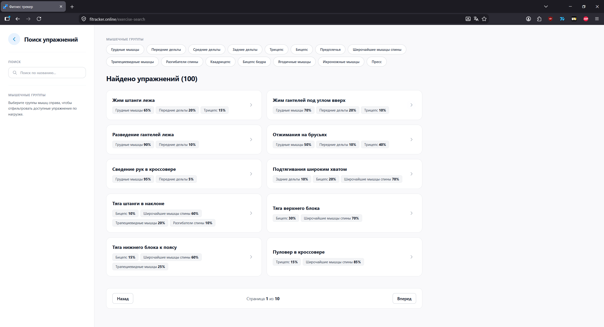

# Fitness-Tracker


**Fitness-Tracker** - серверная часть веб-приложения для записи, хранения и анализа ваших тренировок

**Репозиторий фронтенда:** [Fitness-Tracker Frontend](https://github.com/murphyqwek/fintess-tracker-client)
**Сайт:** [Fitracker]([https://github.com/murphyqwek/fintess-tracker-client](https://fitracker.online/))

---

## Скриншоты интерфейса

<div align="center">
  
  <p><em>Главный дашборд и история тренировок</em></p>

  
  <p><em>Поиск упражнений и фильтрация по группам мышц</em></p>
</div>

---

## Основные возможности

- **Каталог упражнений:** быстрый поиск упражнений по названию и целевым мышечным группам
- **Управление тренировками:** создание, сохранение и просмотр истории тренировочных сессий (подходы, повторения, рабочие веса)
- **Базовая аналитика:** расчет тренировочных объемов и отслеживание регулярности занятий
- **Высокая производительность:** кэширование данных с помощью **Redis Stack Server**
- **Безопасность:** авторизация и аутентификация пользователей на базе JWT токенов.

---

## Стек технологий

- **Backend:** ASP.NET Core, Entity Framework Core
- **База данных:** PostgreSQL
- **Кэширование:** Redis Stack Server
- **Контейнеризация:** Docker, Docker Compose
- **Frontend клиент:** Angular, Tailwind CSS

---

## Быстрый старт (Docker Compose)

### 1. Клонирование репозитория
```bash
git clone https://github.com/murphyqwek/fitness-tracker.git
cd fitness-tracker
```

### 2. Настройка переменных окружения (`.env`)
Создайте файл `.env` в корневой директории проекта рядом с `docker-compose.yml`:

```env
# Имя собираемого/используемого Docker-образа бэкенда
IMAGE_NAME=fitness-tracker-api:latest

# PostgreSQL
DB_NAME=fitness_tracker_db
DB_USER_APP=postgres
DB_PASSWORD_APP=your_strong_password
DB_OUT_PORT=5432
DB_MAX_POOL_SIZE=4

# Redis
REDIS_PASSWORD=your_redis_password

# JWT Token
JWT_KEY=your_super_secret_jwt_key_with_at_least_32_characters
```

### 3. Сборка Docker-образа приложения
Так как `docker-compose` ожидает готовый локальный образ, соберите его с помощью `Dockerfile`:

```bash
docker build -t fitness-tracker-api:latest .
```
*(Убедитесь, что название тега совпадает со значением `IMAGE_NAME` в вашем файле `.env`)*

### 4. Запуск сервисов
Поднимите всю инфраструктуру (API, PostgreSQL, Redis Stack) одной командой:

```bash
docker-compose up -d
```

### 5. Доступ к сервисам
После успешного старта будут доступны:
- 🌐 **Backend API:** `http://localhost:8080`
- 📄 **Swagger UI:** `http://localhost:8080/swagger` *(если включен в Production)*
- 🐘 **PostgreSQL:** `localhost:${DB_OUT_PORT}`
- 🔴 **Redis Stack:** `localhost:6379`

Остановка контейнеров:
```bash
docker-compose down
```

---

##  Наполнение базы данных (Сидинг)

В папке **`Database Scripts`** подготовлены готовые SQL-скрипты для первичного наполнения базы данных начальными справочниками:

1. **Скрипт групп мышц** - добавляет 15 основных анатомических мышечных групп
2. **Скрипт упражнений** - наполняет базу каталогом из 100 базовых и изолирующих упражнений с готовой привязкой к соответствующим группам мышц

> *Выполните эти скрипты по очереди после первого применения миграций через любой удобный инструмент (pgAdmin, DBeaver или консольный `psql`).*

---

## TODO

- [ ] **Расширенная аналитика:** построение графиков прогресса рабочих весов (1RM) и диаграмм распределения нагрузки
- [ ] Пользовательские шаблоны тренировок
- [ ] Подробное описание выполнения упражнений
- [ ] Видео-примеры выполнения упражнений
- [ ] Добавление встроенного таймера отдыха между подходами
- [ ] Интеграция с Telegram-ботом для напоминаний и быстрых заметок
- [ ] Интеграция **LLM** для преобразования неструктурированных пользовательских заметок о тренировках к программному стандарту

---

## Лицензия

Этот проект распространяется под лицензией [MIT](LICENSE).
